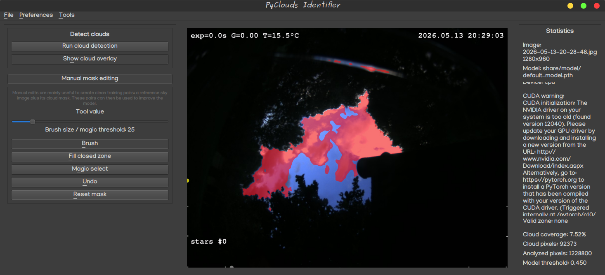

# PyClouds 0.1.4

PyClouds is an open-source cloud detection and cloud coverage estimation framework written in Python.

It is in early development stage for now.

The project aims to provide a lightweight, extensible, and community-driven solution for:

* estimating cloud coverage from all-sky images,
* creating and editing cloud masks,
* training custom machine learning models,
* sharing training datasets to continuously improve a common cloud detection model

PyClouds was originally designed for astronomy applications (all-sky cameras, observatories, weather
assessment), but it can be adapted to many other cloud detection use cases.




---

# Usage

For Windows users, just download and launch PyClouds.exe.
Automation can be used through `PyClouds.exe --no-gui my_file.jpg` command.

---

# Installation

## Create a virtual environment

Linux:

```bash
python3 -m venv venv
source venv/bin/activate
```

Windows:

```cmd
python -m venv venv
venv\Scripts\activate
```

---

## Install CPU version

```bash
python install-requirements.py --mode cpu
```

---

## Install GPU version

Example:

```bash
python install-requirements.py --mode gpu126
```
---

# Creating Training Data

One of the main goals of PyClouds is to simplify the creation of training datasets.

Typical workflow:

1. Load an image.
2. Run cloud identification.
3. Correct the mask manually.
4. Save the image/mask pair.

The resulting files typically look like:

```text
2026-05-13-20-25-03.jpg
2026-05-13-20-25-03_mask.png
```

Send your (anonymized) image pairs to PyClouds' author on GitHub.

Contributed training pairs will be merged into a common dataset used to train improved public models.

Benefits:

* Better cloud detection
* More robust models
* Wider weather conditions
* Different cameras and optics
* Improved generalization

Every contributor benefits from improvements made possible by the community dataset.

---

# Recommended Data

Useful training data includes:

* All-sky cameras
* Observatory cameras
* Fisheye lenses
* Daytime images
* Nighttime images
* Partial cloud cover
* Overcast conditions
* Thin clouds
* High clouds
* Contrails
* Moonlit clouds
* Different seasons
* Different climates
* Different geographic locations
* Different moon phases

Diversity is valuable...

---

# License

See LICENSE file.

---

# Contributing

Contributions are welcome.

Bug reports, feature requests, training datasets, documentation improvements, and pull requests are greatly appreciated.
